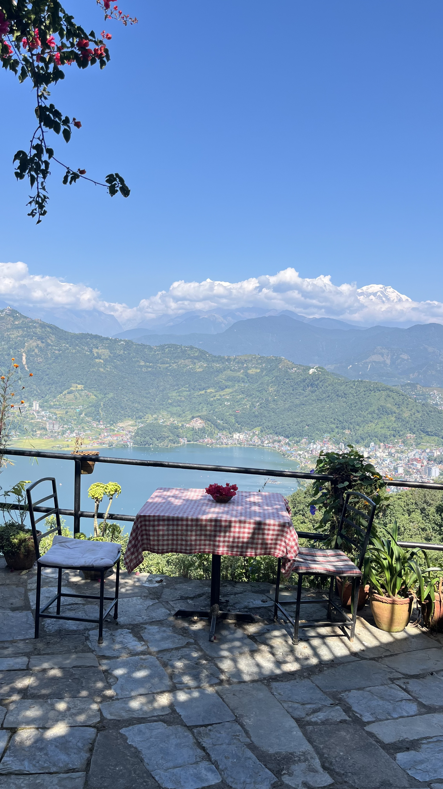
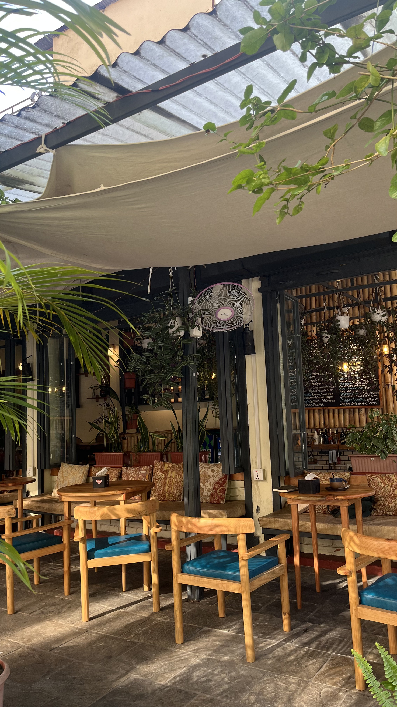
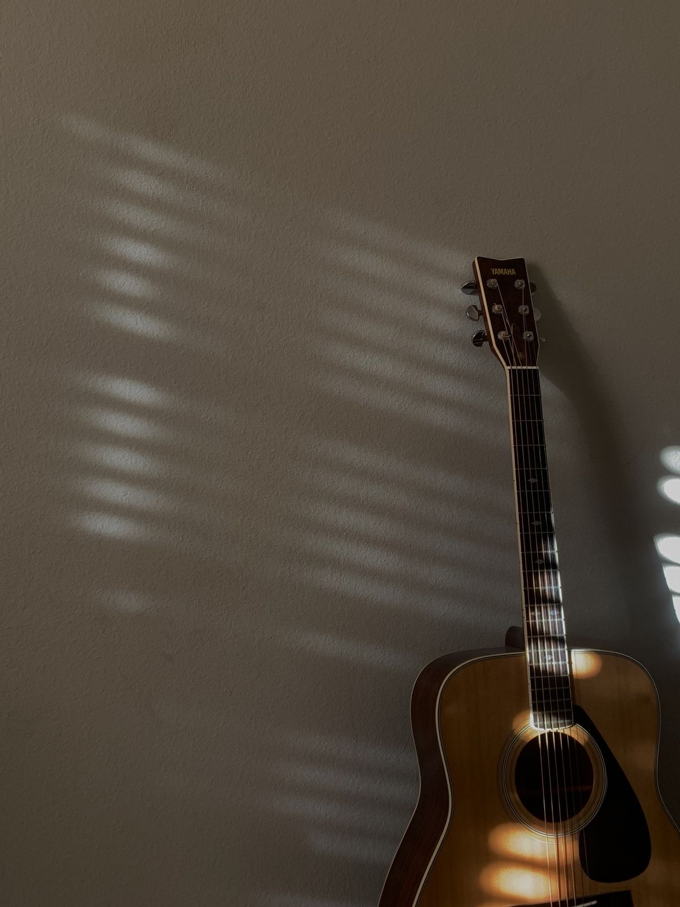

```{=html}
<div style="display:flex; flex-wrap:wrap; gap:2.5rem; align-items:flex-start; margin-top:1rem;">

  <div style="flex:1 1 340px; min-width:300px; max-width:480px;">
    <div id="photoCarousel" class="carousel slide" data-bs-ride="carousel">
      <div class="carousel-indicators">
        <button type="button" data-bs-target="#photoCarousel" data-bs-slide-to="0" class="active" aria-label="Photo 1"></button>
        <button type="button" data-bs-target="#photoCarousel" data-bs-slide-to="1" aria-label="Photo 2"></button>
        <button type="button" data-bs-target="#photoCarousel" data-bs-slide-to="2" aria-label="Photo 3"></button>
        <button type="button" data-bs-target="#photoCarousel" data-bs-slide-to="3" aria-label="Photo 4"></button>
      </div>
      <div class="carousel-inner" style="border-radius:10px;">
        <div class="carousel-item active">
          
        </div>
        <div class="carousel-item">
          
        </div>
        <div class="carousel-item">
          
        </div>
        <div class="carousel-item">
          
        </div>
      </div>
      <button class="carousel-control-prev" type="button" data-bs-target="#photoCarousel" data-bs-slide="prev">
        <span class="carousel-control-prev-icon" aria-hidden="true"></span>
        <span class="visually-hidden">Previous</span>
      </button>
      <button class="carousel-control-next" type="button" data-bs-target="#photoCarousel" data-bs-slide="next">
        <span class="carousel-control-next-icon" aria-hidden="true"></span>
        <span class="visually-hidden">Next</span>
      </button>
    </div>
  </div>

  <div style="flex:1 1 340px; min-width:300px;">
    <div style="font-size:2.25rem; font-weight:700; line-height:1.1; margin-top:0; margin-bottom:1.2rem;">अभिशेक बराइली</div>

    <p style="margin-bottom:1.2rem;">
      <a href="https://github.com/abhishekbaraili" class="btn btn-outline-dark btn-sm"><i class="bi bi-github"></i> GitHub</a>
      <a href="https://www.linkedin.com/in/abhishek-baraili-77b1aa29a/" class="btn btn-outline-dark btn-sm"><i class="bi bi-linkedin"></i> LinkedIn</a>
      <a href="mailto:abhishek_becon2022@kusoa.edu.np" class="btn btn-outline-dark btn-sm"><i class="bi bi-envelope"></i> Email</a>
    </p>

    <p>I am a final-year economics undergraduate. I work on applied statistics and causal inference, mostly with Nepali data.</p>

    <p>This site is where I write up short projects: one question, a research design, and whatever it takes in R, Python, or Stata to answer it. Some work, some don't.</p>
  </div>

</div>
```
```{=html}
<div style="margin-top:3rem;">
  <h2 style="font-size:1.4rem; font-weight:600; margin-bottom:1.2rem;">Undergraduate Research</h2>

  <div style="border:1px solid #e0e0e0; border-radius:10px; padding:1.2rem 1.5rem; margin-bottom:1rem;">
    <div style="font-weight:600; font-size:1rem; margin-bottom:0.3rem;">Ward-Chair Identity and Drinking Water Access: Evidence from Nepal</div>
    <div style="font-size:0.9rem; color:#555; margin-bottom:0.7rem;">Undergraduate Thesis · Sharp RDD · 2025</div>
    <p style="font-size:0.9rem; margin-bottom:0.8rem;">Elite capture is assumed to be everywhere in South Asia. I test it directly using close ward elections in Nepal. The answer is more complicated than expected.</p>
    <a href="https://github.com/abhishekbaraili/caste-water-rdd-nepal" class="btn btn-outline-dark btn-sm"><i class="bi bi-github"></i> Replication package</a>
  </div>

</div>
```
