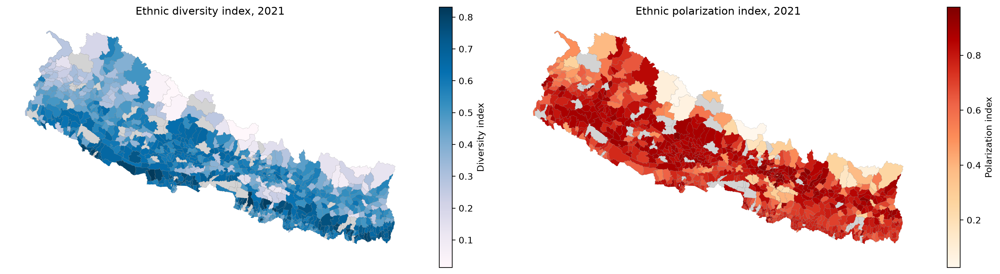
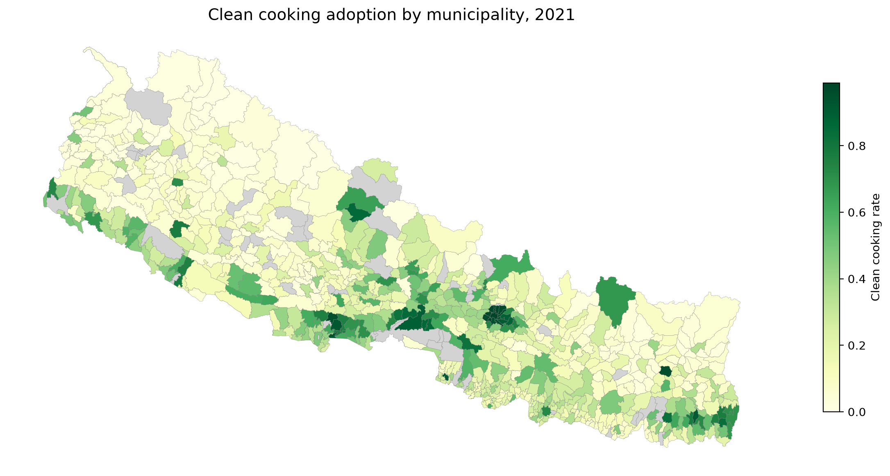
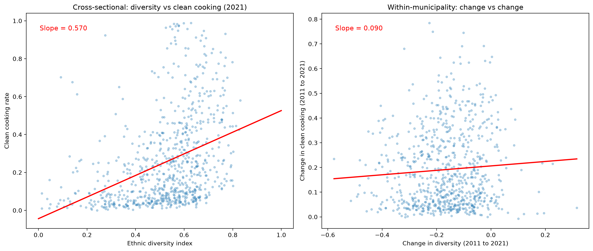

In Nepal, about 84% of households still cook with firewood.[^1] The health consequences are severe: indoor air pollution from solid fuel cooking kills more people in South Asia than malaria.[^2] The transition to clean cooking fuels like LPG, electricity, or biogas is one of the most basic development challenges the country faces, and it is happening unevenly. Some municipalities have almost fully transitioned. Others have barely started.

I wanted to understand why. Specifically, I wanted to know whether the ethnic composition of a municipality, how diverse or divided its population is, has anything to do with how quickly it adopts clean cooking. There are good theoretical reasons to think it might. Ethnically fragmented communities may struggle to coordinate on public goods. Polarized communities, where two or three groups compete for political power, may generate electoral incentives that drive infrastructure investment.

I built a panel dataset covering all 753 of Nepal's municipalities across the 2011 and 2021 censuses and ran three regressions. The first one gave me a large, statistically significant, and completely misleading answer. The second one killed it. The third one replaced it with something I had not expected.

This post is about how I got fooled by my own regression, and what I found when I looked more carefully.

# Data

The panel comes from CBS census microdata. I aggregated household-level records to the municipality level using a VDC-to-municipality crosswalk that maps all 3,906 old VDCs to the 753 new municipalities with 100% coverage. The unit of observation is a municipality-year pair: 753 municipalities observed in two census rounds, giving 1,506 observations.

```python
panel = pd.read_csv('panel_full.csv')
print(f"Observations: {len(panel)}")
print(f"Municipalities: {panel['mnid'].nunique()}")
print(f"Years: {sorted(panel['year'].unique())}")
```

```
Observations: 1506
Municipalities: 753
Years: [2011, 2021]
```

The outcome variable is `clean_cooking`: the share of households in each municipality using LPG, electricity, or biogas as their primary cooking fuel. The mean is 0.16. In a country of 30 million people, that number should bother you.

```python
panel[['clean_cooking', 'div_index', 'pol_index']].describe().round(4)
```

```
       clean_cooking  div_index  pol_index
count       1506.000   1506.000   1506.000
mean           0.160      0.608      0.665
std            0.213      0.179      0.164
min            0.000      0.013      0.027
25%            0.024      0.519      0.586
50%            0.071      0.638      0.703
75%            0.209      0.733      0.784
max            0.988      0.930      0.975
```

The key predictors are two measures of ethnic composition. The first is the standard Alesina et al. (1999) fractionalization index:[^3]

$$D = 1 - \sum_i s_i^2$$

where $s_i$ is the population share of ethnic group $i$. This measures the probability that two randomly selected individuals belong to different groups. It is highest when many small groups coexist, as they do in parts of the Terai where Tharu, Madhesi, Brahmin, Chhetri, Magar, and Dalit communities live side by side.

The polarization index captures something different.[^4] It is highest not when there are many groups, but when the population splits evenly between a few large ones. A municipality that is 50% Brahmin-Chhetri and 50% Janajati is more polarized than one that has fifteen small ethnic groups, even though the latter is more diverse.

These are not the same variable. Here is what they look like across Nepal:

```python
fig, axes = plt.subplots(1, 2, figsize=(16, 7))

merged.plot(column='div_index', cmap='PuBu', edgecolor='grey', linewidth=0.1,
            legend=True, ax=axes[0], missing_kwds={'color': 'lightgrey'},
            legend_kwds={'label': 'Diversity index', 'shrink': 0.6})
axes[0].set_title('Ethnic diversity index, 2021')
axes[0].axis('off')

merged.plot(column='pol_index', cmap='OrRd', edgecolor='grey', linewidth=0.1,
            legend=True, ax=axes[1], missing_kwds={'color': 'lightgrey'},
            legend_kwds={'label': 'Polarization index', 'shrink': 0.6})
axes[1].set_title('Ethnic polarization index, 2021')
axes[1].axis('off')
plt.tight_layout()
```



The spatial patterns are visibly different. Diversity peaks in the Terai, the southern plains where migration and historical trade routes have mixed populations over centuries. Polarization is strongest in the mid-hills, where Bahun-Chhetri and Janajati populations often split municipalities into two roughly equal blocs. The far-western hills are highly polarized but not particularly diverse. Parts of the eastern Terai are highly diverse but not polarized. The two indices are telling different stories about the same country.

And here is what clean cooking adoption looks like:

```python
fig, ax = plt.subplots(1, 1, figsize=(12, 7))
merged.plot(column='clean_cooking', cmap='YlGn', edgecolor='grey', linewidth=0.15,
            legend=True, ax=ax, missing_kwds={'color': 'lightgrey'},
            legend_kwds={'label': 'Clean cooking rate', 'shrink': 0.6})
ax.set_title('Clean cooking adoption by municipality, 2021', fontsize=14)
ax.axis('off')
plt.tight_layout()
```



The dark green clusters are where you would expect them: Kathmandu valley, Pokhara, the larger Terai cities. These are the places with LPG distribution networks, paved roads, and household incomes that can absorb the cost of a gas cylinder. The rest of the country is pale. The Karnali region in the far west is almost entirely firewood.

# Models

## Model 1: Pooled OLS

$$\text{clean\_cooking}_{it} = \beta_0 + \beta_1 \text{div}_{it} + \mathbf{X}_{it}\gamma + \delta_t + \varepsilon_{it}$$

The simplest possible approach. Pool both years, regress clean cooking on the diversity index with controls for household ownership rate, share of male-headed households, literacy of household head, age of household head, and a year dummy. Cluster standard errors at the municipality level.

```stata
reg clean_cooking div_index house_ownership male_head literate_head age_head i.year, vce(cluster mnid)
```

```
                                 (Std. err. adjusted for 753 clusters in mnid)
------------------------------------------------------------------------------
             |               Robust
clean_cooking| Coefficient  std. err.      t    P>|t|
-------------+----------------------------------------------------------------
   div_index |    .281015   .0232124    12.11   0.000
house_owners~|  -1.410214   .1254265   -11.24   0.000
   male_head |   .0294265   .0339457     0.87   0.386
literate_head|   .1349062   .0411034     3.28   0.001
    age_head |  -.0055449   .0014669    -3.78   0.000
  year(2021) |    .212367   .0071124    29.86   0.000
       _cons |   1.373306   .1276338    10.76   0.000
------------------------------------------------------------------------------
```

The diversity coefficient is 0.281, significant at the 0.1% level. A one-unit increase in the fractionalization index is associated with 28 percentage points more clean cooking. The t-statistic is 12.11. The R-squared is 0.635. By any textbook standard, this is a strong, convincing result.

If I had stopped here, I would have written a paper arguing that ethnic diversity drives clean energy transitions through some combination of knowledge diffusion, market integration, and social learning across group boundaries. The mechanism would have sounded plausible. The statistics would have looked solid. And the conclusion would have been wrong.

The problem is that this regression compares across municipalities. It asks: do places with higher diversity have higher clean cooking rates? They do. But the places that happen to be diverse also happen to be urban, lowland, close to the Indian border where LPG comes from, and wealthier. The diversity coefficient is absorbing all of that.

## Model 2: Municipality Fixed Effects

$$\text{clean\_cooking}_{it} = \alpha_i + \beta_1 \text{div}_{it} + \mathbf{X}_{it}\gamma + \delta_t + \varepsilon_{it}$$

The fix is conceptually simple. Add a municipality fixed effect, $\alpha_i$, that absorbs every time-invariant characteristic of each municipality: its altitude, its road access, its distance from the border, its historical settlement patterns, its baseline level of development. What remains is within-municipality variation: how did changes in diversity between 2011 and 2021 relate to changes in clean cooking within the same place?

```stata
xtreg clean_cooking div_index house_ownership male_head literate_head age_head i.year, fe vce(cluster mnid)
```

```
                                 (Std. err. adjusted for 753 clusters in mnid)
------------------------------------------------------------------------------
             |               Robust
clean_cooking| Coefficient  std. err.      t    P>|t|
-------------+----------------------------------------------------------------
   div_index |   .0036839   .0433881     0.08   0.932
house_owners~|  -1.388858   .1671408    -8.31   0.000
   male_head |  -.1165996    .071964    -1.62   0.106
literate_head|   .4440605   .0843941     5.26   0.000
    age_head |  -.0046066   .0035576    -1.29   0.196
  year(2021) |   .1230307   .0165581     7.43   0.000
       _cons |    1.45949   .1692622     8.62   0.000
------------------------------------------------------------------------------
```

0.004. P-value 0.932.

The coefficient didn't just shrink. It disappeared. Within a municipality, changes in ethnic diversity between 2011 and 2021 have zero relationship with changes in clean cooking adoption. The entire cross-sectional pattern was omitted variable bias.

I spent an afternoon checking my code when I first saw this. Reran the regressions from scratch. Checked the merge. Recalculated the diversity index. The code was fine. The relationship really was that confounded.

## Seeing the difference

This is where a picture says what a regression table cannot. The left panel plots diversity against clean cooking across municipalities in 2021, the cross-sectional relationship that the pooled OLS was fitting. The right panel plots *changes* in diversity against *changes* in clean cooking within the same municipality over the decade.

```python
fig, axes = plt.subplots(1, 2, figsize=(14, 6))

# Cross-sectional: diversity vs clean cooking (2021)
axes[0].scatter(d2021['div_index'], d2021['clean_cooking'],
                alpha=0.3, s=10, color='#2c7fb8')
z = np.polyfit(d2021['div_index'], d2021['clean_cooking'], 1)
x_line = np.linspace(0, 1, 100)
axes[0].plot(x_line, z[0]*x_line + z[1], color='red', linewidth=2)
axes[0].set_xlabel('Ethnic diversity index')
axes[0].set_ylabel('Clean cooking rate')
axes[0].set_title('Cross-sectional: diversity vs clean cooking (2021)')

# Within-municipality: change vs change
axes[1].scatter(delta_div, delta_cook, alpha=0.3, s=10, color='#2c7fb8')
z2 = np.polyfit(delta_div[mask], delta_cook[mask], 1)
x2 = np.linspace(delta_div[mask].min(), delta_div[mask].max(), 100)
axes[1].plot(x2, z2[0]*x2 + z2[1], color='red', linewidth=2)
axes[1].set_xlabel('Change in diversity (2011 to 2021)')
axes[1].set_ylabel('Change in clean cooking (2011 to 2021)')
axes[1].set_title('Within-municipality: change vs change')
plt.tight_layout()
```



Cross-sectional slope: 0.570. Within-municipality slope: 0.090.

The steep red line on the left is the illusion. It says: diverse places cook cleaner. True, but useless. The flat red line on the right is the reality. It says: becoming more diverse does not make a place cook cleaner. The two questions sound similar. They are not the same question. And they produce opposite conclusions.

This is the oldest lesson in applied econometrics. I had read about it in Angrist and Pischke.[^5] I had studied it in class. I had nodded along to examples about class size and test scores, hospital quality and mortality rates. And I still fell for it with my own data. The cross-sectional pattern was so clean, so statistically significant, so theoretically plausible, that I did not think to question it until the fixed effects result forced me to.

## Model 3: Adding Polarization

$$\text{clean\_cooking}_{it} = \alpha_i + \beta_1 \text{div}_{it} + \beta_2 \text{pol}_{it} + \mathbf{X}_{it}\gamma + \delta_t + \varepsilon_{it}$$

If diversity does not matter within municipalities, does anything about ethnic composition matter? I add the polarization index alongside diversity in the fixed effects model.

```stata
xtreg clean_cooking div_index pol_index house_ownership male_head literate_head age_head i.year, fe vce(cluster mnid)
```

```
                                 (Std. err. adjusted for 753 clusters in mnid)
------------------------------------------------------------------------------
             |               Robust
clean_cooking| Coefficient  std. err.      t    P>|t|
-------------+----------------------------------------------------------------
   div_index |  -.0513649   .0429609    -1.20   0.232
   pol_index |   .2288694   .0275183     8.32   0.000
house_owners~|  -1.347179   .1637599    -8.23   0.000
   male_head |  -.1277847   .0705382    -1.81   0.070
literate_head|   .4641096   .0797292     5.82   0.000
    age_head |   .0004363   .0034863     0.13   0.900
  year(2021) |   .0702972   .0173027     4.06   0.000
       _cons |    1.08972   .1728379     6.30   0.000
------------------------------------------------------------------------------
```

Polarization: 0.229, p < 0.001. Diversity: still dead.

Within the same municipality over time, a one-unit increase in ethnic polarization is associated with a 23 percentage point increase in clean cooking adoption. This is a large effect with a t-statistic of 8.32.

Why might polarization drive clean cooking adoption when diversity does not? The intuition comes from political economy. Clean cooking is a private good, you buy LPG for your own household, but it depends on public infrastructure: roads that trucks can drive on to deliver gas cylinders, distribution depots, market access. In municipalities where two or three ethnic groups are roughly equal in size, local elections become competitive. Candidates need to deliver visible improvements to win. Infrastructure investment follows. In highly fragmented municipalities with many small groups, no single group has the electoral weight to demand action, and coordination across groups is harder.

This is speculative. I do not have the ward-level electoral data to test it directly (though it exists, and I intend to). But the pattern is consistent with a growing body of work in political economy showing that polarization generates competition while fractionalization generates paralysis.[^6]

# Grand Comparison

```
-----------------------------------------------------------
    Variable |    OLS         FE (div)      FE (div+pol)
-------------+---------------------------------------------
   div_index |  0.281***      0.004         -0.051
   pol_index |                               0.229***
house_owner. | -1.410***     -1.389***      -1.347***
   male_head |  0.029        -0.117         -0.128
literate_h~d |  0.135**       0.444***       0.464***
    age_head | -0.006***     -0.005          0.000
  year(2021) |  0.212***      0.123***       0.070***
       _cons |  1.373***      1.460***       1.090***
-------------+---------------------------------------------
     R-sq    |  0.635         0.719          0.742
-----------------------------------------------------------
                   * p<0.05; ** p<0.01; *** p<0.001
```

Three things happen as you read this table left to right. First, the diversity coefficient goes from 0.281 to zero. Second, the year dummy drops from 0.212 to 0.070, meaning that much of the nationwide increase in clean cooking between 2011 and 2021 was flowing through municipalities where ethnic polarization was changing. Third, the literacy coefficient triples from 0.135 to 0.464, suggesting that within municipalities, the human capital channel is far more important than the cross-section implied. The OLS was understating it because literacy correlates with other municipality characteristics that the fixed effects now absorb.

# What I take from this

I started this project thinking ethnic diversity would straightforwardly predict clean energy adoption. The cross-sectional evidence was strong, statistically significant, and theoretically motivated. It was also almost entirely driven by confounders.

The fixed effects model taught me two things. First, most of the variation in clean cooking across Nepal has nothing to do with ethnic composition. It has to do with geography, infrastructure, and market access: things that get absorbed by the fixed effect and never show up in any coefficient. Second, the piece of ethnic composition that does predict within-municipality changes is not the piece I expected. It is polarization, not diversity.

If there is a broader methodological lesson, it is one I should have internalized before I started: always ask whether your regression is comparing across units or within units, and whether the comparison you are making is the one you actually want. The cross-sectional comparison was not. The within-municipality comparison was. They told opposite stories.


[^1]: CBS Nepal Census 2021. The exact figure is 83.7% of households reporting firewood, cow dung, or other solid fuels as their primary cooking fuel.

[^2]: WHO Global Health Estimates (2019). Household air pollution from solid fuel use is the leading environmental risk factor for death in South Asia, responsible for approximately 1.6 million deaths annually across the region.

[^3]: Alesina, A., Baqir, R., and Easterly, W. (1999). "Public Goods and Ethnic Divisions." *Quarterly Journal of Economics*, 114(4), 1243-1284. The index is also known as the ethno-linguistic fractionalization (ELF) index.

[^4]: The polarization measure follows Montalvo, J.G. and Reynal-Querol, M. (2005). "Ethnic Polarization, Potential Conflict, and Civil Wars." *American Economic Review*, 95(3), 796-816.

[^5]: Angrist, J.D. and Pischke, J.S. (2009). *Mostly Harmless Econometrics: An Empiricist's Companion*. Princeton University Press. Chapter 5 on fixed effects and the distinction between cross-sectional and within-unit variation.

[^6]: See especially Esteban, J. and Ray, D. (2011). "Linking Conflict to Inequality and Polarization." *American Economic Review*, 101(4), 1345-1374; and Alesina, A. and La Ferrara, E. (2005). "Ethnic Diversity and Economic Performance." *Journal of Economic Literature*, 43(3), 762-800.

The Stata do-files and Python visualization code are on [GitHub](https://github.com/abhishekbaraili/ethnicity-energy-nepal).
