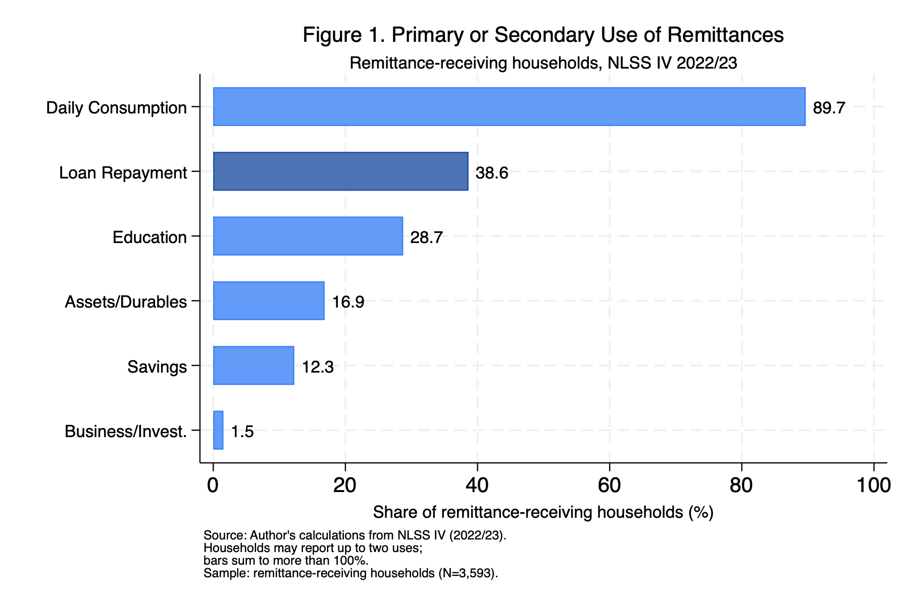
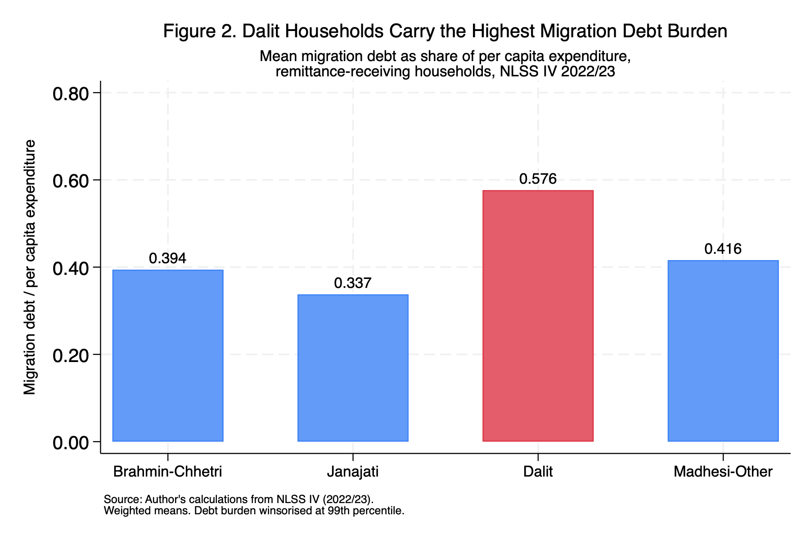

You cannot grow up in Nepal without knowing someone whose family member works abroad. It is not a background fact of Nepali life, it is a foreground one. The neighbour whose husband is in Qatar. The classmate whose older brother sends money from Malaysia every month. The shop owner down the road whose son is somewhere in the Gulf and whose family built a new house last year.

What I noticed, living around this, was a particular pattern in how people talked about remittances. There was pride in the money coming in, and there was also, quietly, a kind of anxiety about debt. Families borrowing to send someone abroad. Families waiting for remittances to arrive not to save or invest, but to pay back what they had already spent. Migration as something that cost money before it made any.

Nepal receives remittances equivalent to roughly a quarter of its entire GDP, which puts it among the most remittance-dependent economies on earth. The conventional story is that this money, over time, should build things: better educated children, small businesses, savings, a ladder out of poverty. I wanted to know whether that was actually happening — and to do that, I used a single cross-sectional wave of household survey data, so what follows is a snapshot, not a trend.

Rather than relying on published summary statistics, I used the household-level microdata from the Nepal Living Standards Survey IV (NLSS IV), conducted by the National Statistics Office in 2022/23. That let me look directly at 3,593 remittance-receiving households and ask what they reported doing with the money.

What I found was not what the optimistic version of the story would predict.

## What the data shows

The remittance module (S14A) records up to two "uses" per absentee — a primary and a secondary. I coded each into a household-level indicator: a household counts as using remittances for education if *any* absentee's remittance is reported going to schooling, and so on for the other categories.

The dominant use of remittances in Nepal is daily consumption. Nearly 90% of remittance-receiving households report it as a primary or secondary use. That is not surprising on its own, consumption is what most income goes toward, especially in lower-income households. But the second most common use stopped me.



Loan repayment. 38.6% of remittance-receiving households report using remittances to repay loans, nearly two in five households. That figure sits above education (28.7%), above assets and durables (16.9%), above savings (12.3%), and vastly above business investment, which is almost invisible at just 1.5%.

The use-category variables and the plot were built directly from the raw NLSS module:

```stata
* Remittance use flags (primary OR secondary), from module S14A
* q14_19 codes: 1=consumption 2=edu(Nepal) 3=edu(abroad) 4=capital
*               5=business 6=assets 7=savings 8=loan 9=tourism 10=other
gen use_education   = (inlist(q14_19_a,2,3) | inlist(q14_19_b,2,3))
gen use_loan        = (q14_19_a==8 | q14_19_b==8)
gen use_consumption = (q14_19_a==1 | q14_19_b==1)
gen use_savings     = (q14_19_a==7 | q14_19_b==7)
gen use_business    = (q14_19_a==5 | q14_19_b==5)
gen use_assets      = (q14_19_a==6 | q14_19_b==6)

* Figure 1 — weighted share of households reporting each use
local use_vars consumption education loan savings business assets
tempname use_means
matrix `use_means' = J(6, 1, .)
local i = 1
foreach v of local use_vars {
    quietly sum use_`v' [aweight = $WT]
    matrix `use_means'[`i', 1] = r(mean) * 100
    local ++i
}
twoway ///
    (bar pct order if highlight == 0, color("59 130 246") barwidth(0.6) horizontal) ///
    (bar pct order if highlight == 1, color("31 81 163")  barwidth(0.6) horizontal) ///
    (scatter order pct, msymbol(none) mlabel(pct) mlabformat(%4.1f)                ///
        mlabposition(3) mlabsize(small))                                           ///
    , legend(off)                                                                   ///
    xtitle("Share of remittance-receiving households (%)")                         ///
    ylabel(1 "Business/Invest." 2 "Savings" 3 "Assets/Durables"                    ///
           4 "Education" 5 "Loan Repayment" 6 "Daily Consumption", angle(0))
graph export "$FIGS/fig1_remit_use.png", replace width(1800)
```

I want to be careful about the historical comparison here, because I have not been able to fully verify the older figures against the source reports. Published NLSS III (2010/11) tabulations suggest loan repayment was a much smaller share of remittance use about twelve years earlier, on the order of single digits, while consumption dominated then as it does now. If that is even approximately right, loan repayment has grown sharply as a reported use of remittances over the intervening years. I flag this as indicative rather than settled: the survey categories are not perfectly comparable across rounds, and I would want the exact CBS tabulations in hand before making anything of the precise magnitudes.

## The mechanism

Once I saw the loan repayment figure, the question became: why? Is this just what happens when households get extra income, they pay off whatever debts they have? Or is there something more specific going on?

The NLSS IV loan module records each household's outstanding loans, including the stated purpose of each loan. That let me identify loans taken specifically for migration: to pay recruitment agents, visa fees, medical clearances, and travel. These are the loans families take out *before* any remittance arrives, to finance the act of migration itself. I then scaled each household's migration debt by its per capita expenditure — a "debt burden" that measures how heavy the borrowing is relative to the household's resources.

```stata
* Migration loans (purpose code 11) from module S13A
local MIGRATION_CODE 11
gen migration_loan     = (q13_06 == `MIGRATION_CODE') if !missing(q13_06)
gen migration_loan_amt = q13_07 * migration_loan
* ... collapsed to household level as total_mig_debt ...

* Debt burden = migration debt relative to per capita expenditure
gen debt_burden = total_mig_debt / pcep
winsor2 debt_burden, cuts(0 99) suffix(_w)   // winsorise top 1% of the ratio
```

What those records show is that migration is expensive before it is profitable. Sending a family member to the Gulf or Southeast Asia typically costs upwards of NPR 210,000 (approximately USD 1,580) at the median — and considerably more for many households, with a mean of NPR 420,000 (approximately USD 3,160) among those carrying migration debt in the NLSS IV sample. Most low-income families do not have that lying around. They borrow, often from informal moneylenders at high interest rates. A significant share of the remittance that eventually comes in is therefore already spoken for before the family sits down to make any decisions about it.

To test whether this debt mechanism was actually associated with the education shortfall, I ran OLS regressions with the household as the unit of analysis. The outcome is whether a household reported using remittances for education. The key variable is the migration debt burden constructed above.

The result was stable across specifications. Controlling for log remittance received, per capita expenditure, caste group, urban location, household size, head's age and sex, and province fixed effects, a one-unit increase in migration debt burden is associated with a **3.6 percentage point** lower probability of remittances being used for education (p < 0.001). The mirror-image regression on loan repayment gives a **10.3 percentage point** higher probability (p < 0.001). Both effects survive a probit specification, a binary debt measure, dropping the Kathmandu Valley, and winsorising the debt burden at the 95th rather than the 99th percentile.

The raw contrast is stark. Among households carrying migration debt, only **17.8%** use remittances for education. Among debt-free households, the figure is **30.7%**.

The two regressions are one line each:

```stata
* Main specification: education use ~ debt burden + controls + province FE
regress use_education debt_burden_w log_remit log_pcep                 ///
    i.casteGrp_broad urban hh_size head_age head_male i.prov           ///
    [aweight = hhs_wt], vce(cluster psu_number)

* Mirror-image outcome: loan repayment
regress use_loan       debt_burden_w log_remit log_pcep                ///
    i.casteGrp_broad urban hh_size head_age head_male i.prov           ///
    [aweight = hhs_wt], vce(cluster psu_number)
```

::: {.callout-note}
## What this can and cannot show

These are associations, not causal claims. The data is cross-sectional: I am looking at households at one point in time, not tracking them before and after taking a migration loan. Households with higher debt may differ from debt-free households in ways I cannot fully observe. What the evidence shows is a consistent, robust pattern across multiple specifications, not a clean experiment.
:::

Here is the main education specification, straight from the Stata console (province fixed-effect rows omitted for length):

```default
Linear regression                               Number of obs     =      3,593
                                                F(16, 782)        =      20.43
                                                Prob > F          =     0.0000
                                                R-squared         =     0.0854
                                                Root MSE          =     .43383

                             (Std. err. adjusted for 783 clusters in psu_number)
--------------------------------------------------------------------------------
               |               Robust
 use_education | Coefficient  std. err.      t    P>|t|     [95% conf. interval]
---------------+----------------------------------------------------------------
 debt_burden_w |  -.0356764   .0071385    -5.00   0.000    -.0496892   -.0216636
     log_remit |   .0234017   .0027066     8.65   0.000     .0180886    .0287149
      log_pcep |   .0794007   .0184439     4.30   0.000     .0431952    .1156061
               |
casteGrp_broad |
     Janajati  |  -.0169238   .0239927    -0.71   0.481    -.0640216    .0301739
        Dalit  |  -.0576608      .0285    -2.02   0.043    -.1136064   -.0017152
Madhesi-Other  |   .0017307   .0370593     0.05   0.963    -.0710167    .0744781
               |
         urban |  -.0599418   .0219797    -2.73   0.007     -.103088   -.0167956
       hh_size |   .0367538   .0053993     6.81   0.000     .0261549    .0473528
      head_age |  -.0018855   .0007434    -2.54   0.011    -.0033449   -.0004262
     head_male |  -.1204044   .0195929    -6.15   0.000    -.1588653   -.0819435
               |
         _cons |  -.7919414   .2394824    -3.31   0.001    -1.262046   -.3218369
--------------------------------------------------------------------------------
```

The coefficient on `debt_burden_w` is −0.036 (t = −5.00): a one-unit increase in migration debt burden is associated with a 3.6 percentage point lower probability of using remittances for education. The `Dalit` indicator is also negative and significant on its own, a point I return to below. (Province fixed effects and the full four-column table are in the replication files.)

## Caste

One more thing emerged that I had not set out to find, but which I think matters more than any single coefficient.

The debt burden is not distributed equally across Nepal's population.



The bar heights are just weighted means of the debt-burden ratio by caste group:

```stata
* Figure 2 — weighted mean debt burden by broad caste group
preserve
    collapse (mean) debt_burden_w [aweight = $WT], by(casteGrp_broad)
    drop if missing(casteGrp_broad)
    gen highlight = (casteGrp_broad == 3)   // Dalit highlighted in red
    twoway                                                             ///
        (bar debt_burden_w casteGrp_broad if highlight == 0,          ///
            color("59 130 246") barwidth(0.6))                        ///
        (bar debt_burden_w casteGrp_broad if highlight == 1,          ///
            color("220 53 69")  barwidth(0.6))                        ///
        (scatter debt_burden_w casteGrp_broad, msymbol(none)          ///
            mlabel(debt_burden_w) mlabformat(%4.3f) mlabposition(12)) ///
        , legend(off)                                                  ///
        ytitle("Migration debt / per capita expenditure")             ///
        xlabel(1 "Brahmin-Chhetri" 2 "Janajati" 3 "Dalit"            ///
               4 "Madhesi-Other")
    graph export "$FIGS/fig2_debt_caste.png", replace width(1800)
restore
```

Dalit households carry a mean migration debt burden of 0.576, which is 71% higher than Janajati households (0.337), 46% higher than Brahmin-Chhetri households (0.394), and 38% higher than Madhesi-Other households (0.416) — the highest burden of any group in the sample. And when I estimated the debt-education relationship separately by caste group, the coefficients diverged sharply.

The formal test — a Dalit × debt-burden interaction term in the pooled regression — is negative (−0.018) but *not* statistically significant (p = 0.16). So I cannot claim, on the strength of the interaction alone, that the debt-education relationship is statistically different for Dalit households. What the split-sample results do show, as illustration rather than proof, is that when the sample is divided by caste group, the coefficient is large and significant for Dalit households (−4.9 percentage points, p < 0.001) and small and insignificant for Brahmin-Chhetri households (−1.7 percentage points, p = 0.17). That is suggestive of a heterogeneous pattern — the subsamples are smaller, the standard errors wider, and I would not want to oversell it.

The two split-sample regressions:

```stata
* Split-sample: debt-education relationship within each caste group
regress use_education debt_burden_w log_remit log_pcep                 ///
    urban hh_size head_age head_male i.prov                            ///
    [aweight = hhs_wt] if dalit == 1, vce(cluster psu_number)

regress use_education debt_burden_w log_remit log_pcep                 ///
    urban hh_size head_age head_male i.prov                            ///
    [aweight = hhs_wt] if casteGrp_broad == 1, vce(cluster psu_number)
```

What does survive the full pooled specification is a level difference: even after controlling for per capita expenditure, Dalit households are 5.8 percentage points less likely to use remittances for education than Brahmin-Chhetri households (p = 0.04). Whatever is going on, it is not simply that Dalit households are poorer, because expenditure is already in the model.

The plausible mechanism, which the data hints at but cannot confirm, is that Dalit households are more likely to be channelled toward low-wage migration destinations where earnings are not sufficient to clear recruitment debts quickly. They borrow more relative to what they earn, and they pay it back more slowly. The remittance cycle that is a manageable short-term inconvenience for wealthier families may, for these households, be a longer structural constraint.

## Where this leaves me

I want to be careful about what I claim this establishes. It has not proven, in any rigorous causal sense, that migration debt causes households to invest less in education. What it has shown is a consistent, robust association, across multiple specifications, robustness checks, and subgroups, between carrying migration debt and being less likely to direct remittances toward education. The pattern is strong enough and stable enough that I find it hard to dismiss.

There are also questions the data cannot answer. Is migration becoming more debt-intensive over time, or are households with more debt simply more likely to migrate in the first place? Does the education figure genuinely reflect investment in schooling, or does it lump in one-time fees and supplies? Does the pattern look different across destination countries? These are the natural next steps, and most of them need panel data or a credible source of exogenous variation that this cross-section does not give me.

What I know is that I started with a vague observation, that migration and debt seemed tangled together in the Nepal I grew up around, and the data confirmed that instinct in a way that felt more disquieting than satisfying. The families receiving this money are not failing to invest in education because they do not want to. Many of them cannot, because the money was spent before it arrived.

That is a solvable problem. Whether it gets solved is a different question, and not one a dataset can answer.

---

*Data: Nepal Living Standards Survey IV (2022/23), National Statistics Office of Nepal. Sample: 3,593 remittance-receiving households out of 9,600 total. OLS with province fixed effects, standard errors clustered at the PSU level, household survey weights throughout. This is an independent side project, not part of any formal paper or publication.[^caveat]*

[^caveat]: The findings here are exploratory and descriptive. Everything rests on a single cross-section of NLSS IV, so the estimates are associations rather than causal effects, and I have not subjected them to the kind of scrutiny a submitted paper would require. I am sharing the analysis because the pattern seemed worth documenting, not because I consider it settled. Corrections and pushback are welcome.
